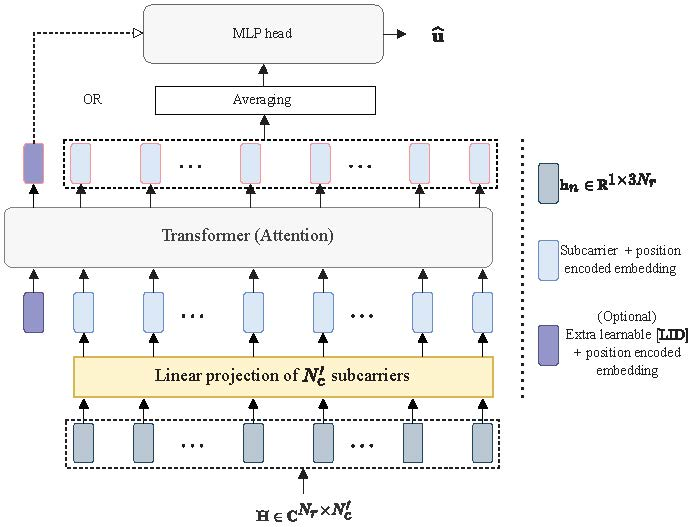
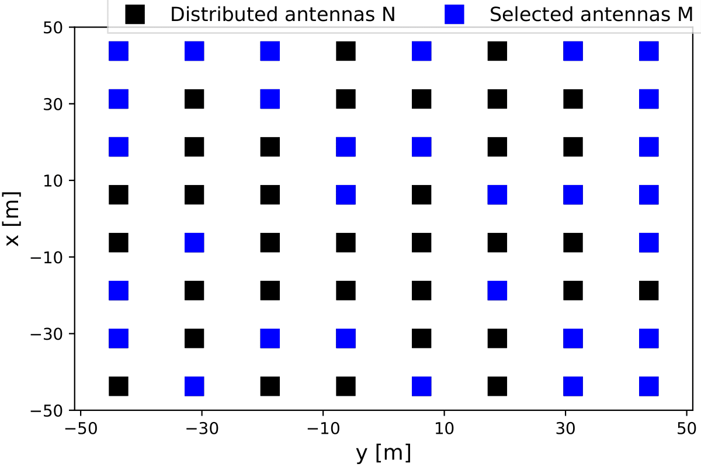
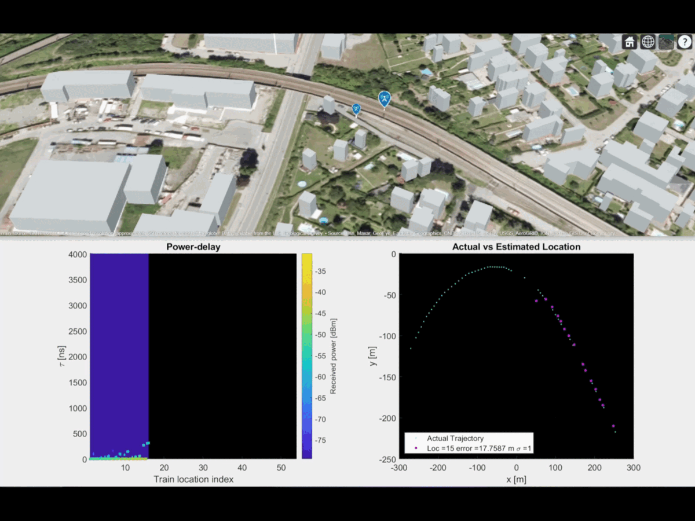
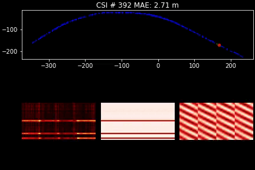
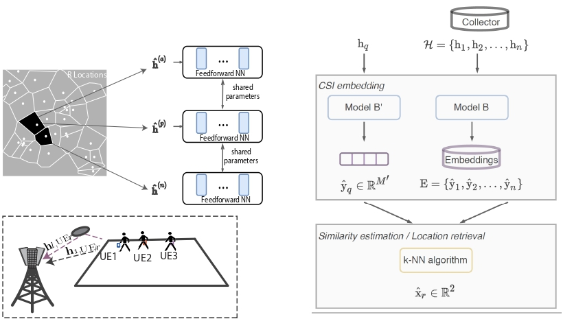

# SWiT Additional Analysis.
## Setup
Dependencies: 
- python (>=3.7)
- Torch: 1.10.0+cu111
- Check other imported libraries (or use Colab).

**Reproducibility**  

- Checkout Colab notebook for logs and a [demonstration](https://drive.google.com/file/d/1BHFtmGYVj2VWEXTKWjAVp502mIyuBiTr/view?usp=sharing).
- Details of [SWiT training dynamics](swit_train_dynamic.txt).


### Cite
```
@misc{salihu2023selfsupervised,
    title={Self-Supervised and Invariant Representations for Wireless Localization},
    author={Artan Salihu and Stefan Schwarz and Markus Rupp},
    year={2023},
    eprint={2302.07000},
    archivePrefix={arXiv},
    primaryClass={eess.SP}
}
```

#### Other Works


|               Work       |   |  
|---------------------------------|---|
| [WiT and SWiT](https://ieeexplore.ieee.org/document/9253408)        | <p align="center"></p>  |
| [RRH Selection](https://ieeexplore.ieee.org/document/9815773) | <p align="center"></p> |
| [Uncertainty Wireless Loc](https://ieeexplore.ieee.org/document/9616218)        | <p align="center"></p> |
| Channel Subspace                | <p align="center"></p>|
| [Low-dimensional Representations](https://ieeexplore.ieee.org/document/9253408)        | <p align="center"></p>  |
